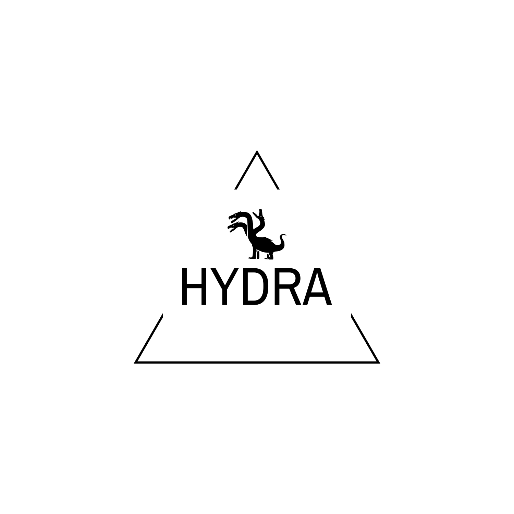

# HYDRA
>  
> Original project from CSP (NEXA) by DevHolic

> ### HYDRA Project
> This project is created for malicious process removal, network connection management, and process management.

> ### Base Programming Language
> 

> ### Base System Module
> - [psutil](https://pypi.org/project/psutil/)
> - [tkinter](https://docs.python.org/3/library/tkinter.html)

> ### Version Log
> - [HYDRA 2.0.0 (Latest)](https://github.com/DevHolicOffical/HYDRA/tree/main/HYDRA%202.0.0)
> - [HYDRA 1.4.0](https://github.com/DevHolicOffical/HYDRA/tree/main/HYDRA%201.4.0)
